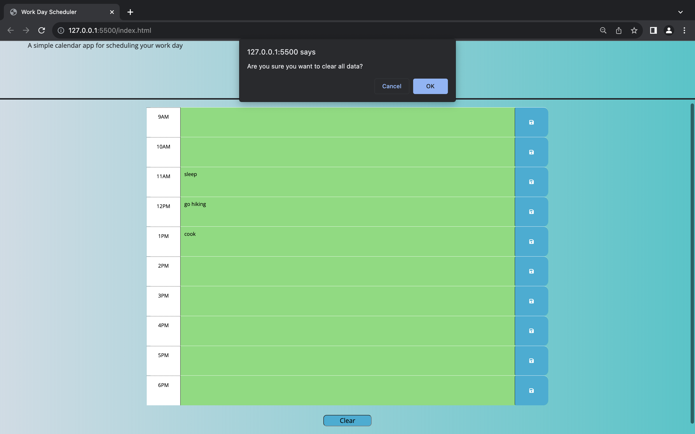
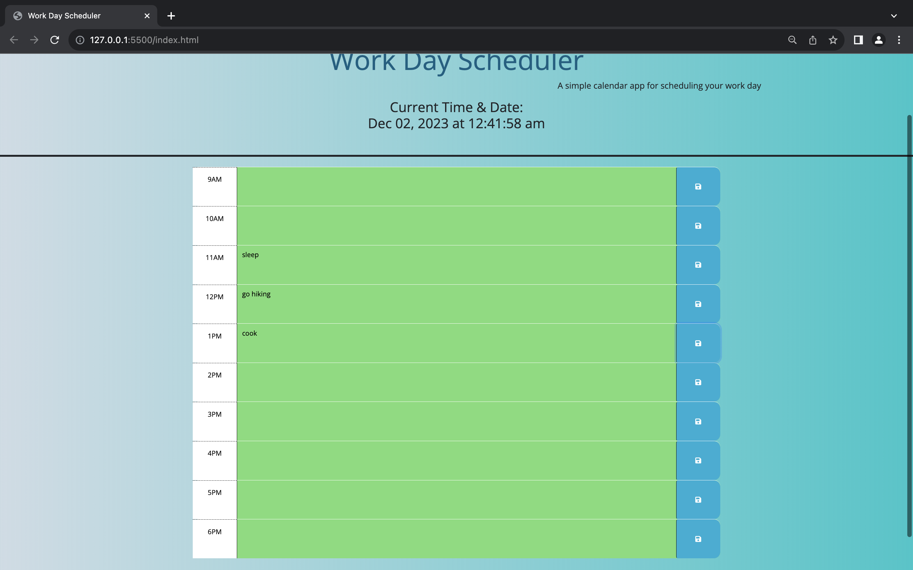
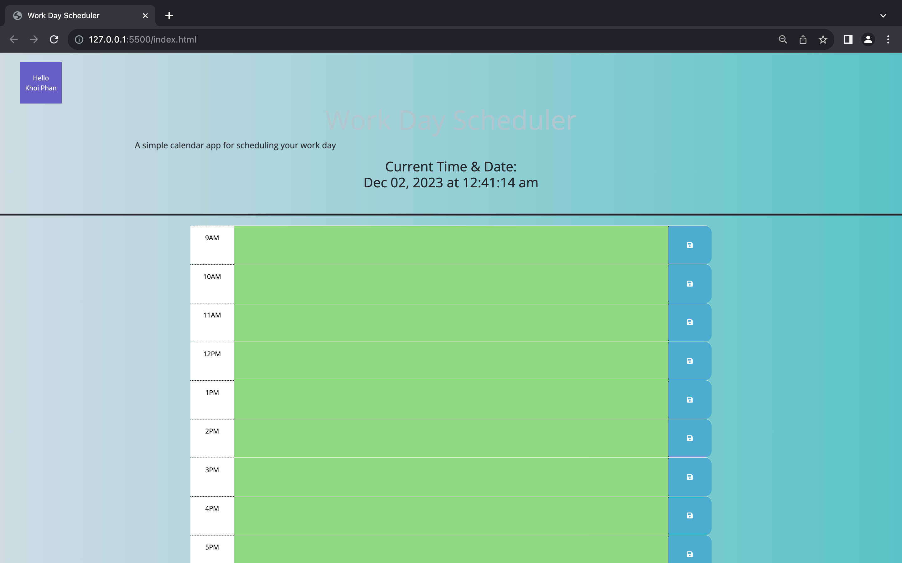

# 05 Third-Party APIs: Work Day Scheduler
hw 5, javascript, jquery, bootstrap css
A simple calendar application that allows a user to save events for each hour of the day. This app runs in the browser and features dynamically updated HTML and CSS powered by jQuery.

## Application Description

This is a simple calendar application (utilizing JQuery, Local Storage, and Day.js) that allows a user to save events for each hour of the day. HTML and CSS are dynamically updated according to the time--the background colors of the time blocks are adjusted based upon the classification of the time event (past, present, or future.) The user inputs calendar items into the text area, and clicking the save buttons sets the items into local storage. The added calendar items persist on the page after refresh.

## User Story

```md
AS AN employee with a busy schedule
I WANT to add important events to a daily planner
SO THAT I can manage my time effectively
```

## Acceptance Criteria

```md
GIVEN I am using a daily planner to create a schedule
WHEN I open the planner
THEN the current day is displayed at the top of the calendar
WHEN I scroll down
THEN I am presented with timeblocks for standard business hours
WHEN I view the timeblocks for that day
THEN each timeblock is color coded to indicate whether it is in the past, present, or future
WHEN I click into a timeblock
THEN I can enter an event
WHEN I click the save button for that timeblock
THEN the text for that event is saved in local storage
WHEN I refresh the page
THEN the saved events persist
```

The following animation demonstrates the application functionality:

## Pseudo Code for HTML

1. A main header.
2. Div element within container fluid
3. List of time blocks with 24hr to 12hr conversion
4. Text input fields
5. Save buttons
6. Font families
7. Bootstrap component
8. Jquery links

## Pseudo Code for CSS

1. HTML attributes and classes

## Pseudo Code for JavaScript

1. Tells engine to load HTML and CSS first.
2. Displays current time and date.
3. Get nearby values.
4. Takes change from children HTML description attribute.
5. Takes change from parent HTML ID attribute.
6. Sets items to local storage.
7. Loads saved data from local storage for each hour created. Should follow HTML 24h to 12 h conversion.
8. Gets current number of hours.
9. Use of Day.js
10. Loops over time blocks.
11. Checks if time is past, present, future. Clicks into HTML/CSS given classes of past, present, future.
12. Re-runs function.
13. Created a Clear Button that clear data and refresh the page

Below are images of the user interface of the calendar as displayed to the user:









URL to deployed application:  https://khoiphan-9194.github.io/Work-Day-Scheduler/


URL to GitHub repository:  https://github.com/khoiphan-9194/Work-Day-Scheduler/


For any questions, please contact me at phanminhkhoi91@gmail.com

